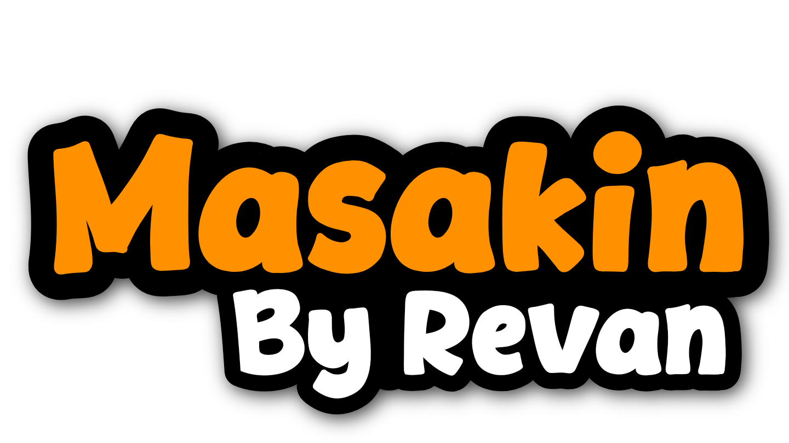

# Arsitektur MASAKIN

<p align="center">
  
</p>

## Pola Arsitektur

Aplikasi menggunakan **MVVM (Model-View-ViewModel)** dengan satu ViewModel utama (`BudgetViewModel`) dan repository tunggal (`BudgetRepository`).

```
┌─────────────────────────────────────────────────────────┐
│                      MainActivity                        │
│  Scaffold: TopBar | NavGraph | BottomBar | NeoToastHost │
└──────────────────────────┬──────────────────────────────┘
                           │
┌──────────────────────────▼──────────────────────────────┐
│                    UI Layer (Compose)                    │
│  DashboardScreen | PlannerScreen | BudgetScreen | ...   │
└──────────────────────────┬──────────────────────────────┘
                           │
┌──────────────────────────▼──────────────────────────────┐
│                   BudgetViewModel                        │
│  StateFlow / MutableStateFlow, coroutines, AI logic      │
└──────────────────────────┬──────────────────────────────┘
                           │
┌──────────────────────────▼──────────────────────────────┐
│                   BudgetRepository                       │
└───────┬─────────────────────────────┬───────────────────┘
        │                             │
┌───────▼────────┐            ┌───────▼────────┐
│  Room Database │            │   DataStore    │
│  (SQLite)      │            │  (Preferences) │
└────────────────┘            └────────────────┘
        │
┌───────▼────────┐
│  Retrofit API  │  Gemini + Vercel fallback
└────────────────┘
```

## Layer UI

| Komponen | File | Fungsi |
|----------|------|--------|
| MainActivity | `MainActivity.kt` | Root, splash, navigasi, dialog global |
| MasakinTopBar | `MainActivity.kt` | Logo + Settings + indikator budget warning |
| NeoBottomNavigation | `MainActivity.kt` | Tab MENU / JADWAL / DOMPET / BELANJA |
| SetupNavGraph | `NavGraph.kt` | NavHost empat layar |
| MasakinSplashScreen | `MasakinSplashScreen.kt` | Splash putih + logo full |
| ApiKeyWelcomeDialog | `ApiKeyWelcomeDialog.kt` | Onboarding API key pertama kali |
| ApiKeySettingsDialog | `ApiKeySettingsDialog.kt` | Input dan deteksi model Gemini |
| NeoToastHost | `NeoToast.kt` | Toast global neo-brutalist |
| NeoCard / NeoButton | `NeoBrutalist.kt` | Komponen desain sistem |

## State Management

| State | Tipe | Pemilik |
|-------|------|---------|
| budget, grocery, favorites, weeklyPlan | `StateFlow` | ViewModel (dari Room) |
| userApiKey | `StateFlow` | ViewModel (dari DataStore) |
| isGenerating, generatedRecipes | `MutableStateFlow` | ViewModel |
| showApiSettingsDialog, showApiKeyWelcomeDialog | `MutableStateFlow` | ViewModel |
| UI form lokal (input teks, tab aktif) | `remember` | Composable screen |

## Alur Fitur AI Generator

1. User pilih bahan + slider budget di `DashboardScreen`
2. `BudgetViewModel.generateRecipesWithAI()` dipanggil
3. API Key dibaca dari DataStore
4. Loop model Gemini (urutan preferensi) via Retrofit
5. Jika semua model gagal, fallback ke endpoint Vercel
6. Respons JSON diparse ke `GeneratedRecipeMock`
7. Hasil ditampilkan di kartu resep; bisa disimpan ke Wishlist atau Jadwal

## Alur Budget dan Jadwal

| Aksi | Dampak database |
|------|-----------------|
| Tambah resep ke jadwal | Update `weekly_plans`, kurangi `budget.currentBalance` |
| Hapus jadwal satu hari | Clear hari, restore saldo |
| Kosongkan semua jadwal | Clear semua hari, restore total biaya |
| Tambah pengeluaran manual | Kurangi saldo di `budget` |

## Dependency Injection

Saat ini menggunakan factory manual di `BudgetViewModel.Factory` dan `ChefAiApplication` untuk menyediakan `BudgetRepository` dan `AppDatabase`. Tidak menggunakan Hilt/Koin.
